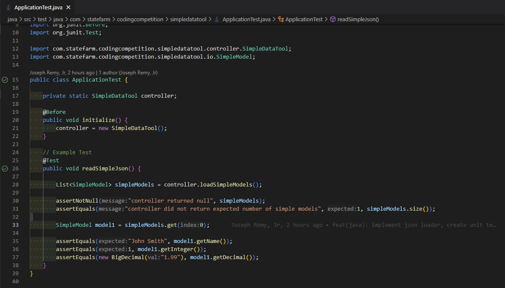

# 2023 State Farm Coding Competition - Round 1 - Java Version

## Welcome

This is the stub project for the 2023 State Farm Coding Competition Round 1 in Java. This will be the same project you'll use once Round 1 begins.

This is to just get you started -- making sure your computer is setup, that you are able to build and run the project (including unit tests), and getting familiar with the structure. Once Round 1 begins, we'll add the problem statement and the actual JSON files and unit tests you'll be using.

## Setup

### Pre-Req

- Java JDK - version 17 or higher
- Maven - version 3.8.6 or higher

#### Java

We recommend one of the following JDKs and versions. Other ones may also work, but have not been tested.

- [Oracle JDK 17](https://www.oracle.com/java/technologies/downloads/#jdk17-windows)
- [OpenJDK 17 via Microsoft](https://learn.microsoft.com/en-us/java/openjdk/download#openjdk-17)

#### Maven

- [Apache Maven Download](https://maven.apache.org/download.cgi)
- [Apache Maven Install Guide](https://maven.apache.org/install.html)

#### Git and VSCode

For setting up Git and VSCode, please see [the overall README.md](../README.md).

#### VSCode Extensions

When you open this folder up in VSCode, you should see a dialog box open in the bottom-right hand corner of your screen. We've added several extensions that should help you spend less time on your environment, syntax, and manual work and more time on working on the problem statement.

You can view this file in `.vscode/extensions.json`.

## Run

To build and test this project:

```sh
mvn clean install
```

In VSCode, you can also run the unit tests either per file or per method. See the screenshot below for examples.



You should see the circles on the left-hand side. They are checkmarks in this case, because we've already run the unit tests, but they can also come up as a red circle for failures or a green play button.

For more information, see Microsoft's official guide - [Testing Java with Visual Studio Code - Features Section](https://code.visualstudio.com/docs/java/java-testing#_features).

**Note: Use this functionality for quick and easy testing, but, before you turn your submission in, please attempt to run the maven command at least once to determine how many unit tests have been passed.**
